# Network Traffic Analysis Lab
### This project demonstrates a comprehensive workflow for capturing and analyzing network traffic within a Linux environment using wireshark. It covers secure installation practices, protocol-specific analysis for HTTP and HTTPS, and the application of advanced display filters to isolate specific network conversations. By examining TLS handshakes and unencrypted traffic, this lab highlights the practical differences between secure and insecure communication channels
## Task 1
### Install and set up Wireshark on Ubuntu:
* To get the latest stable version of Wireshark on Ubuntu Linux, use the add-apt-repository
```
command: sudo add-apt-repository ppa:wireshark-dev/stable
```
* Wireshark should not be run as superuser for security reasons.
* The user can be added to the Wireshark group to add packet capture capabilities: sudo
usermod -aG wireshark $USER
## Task 2
### Start a packet capture on an ethernet port and save it to file:
* The wired interface includes the ethernet packet capture, which begins with ‘en’ in Wireshark.
* The Wireshark app includes controls to start packet capture, stop capture, save the packets to
a file, and load the capture file.
* A capture can only be saved once the capture has stopped.

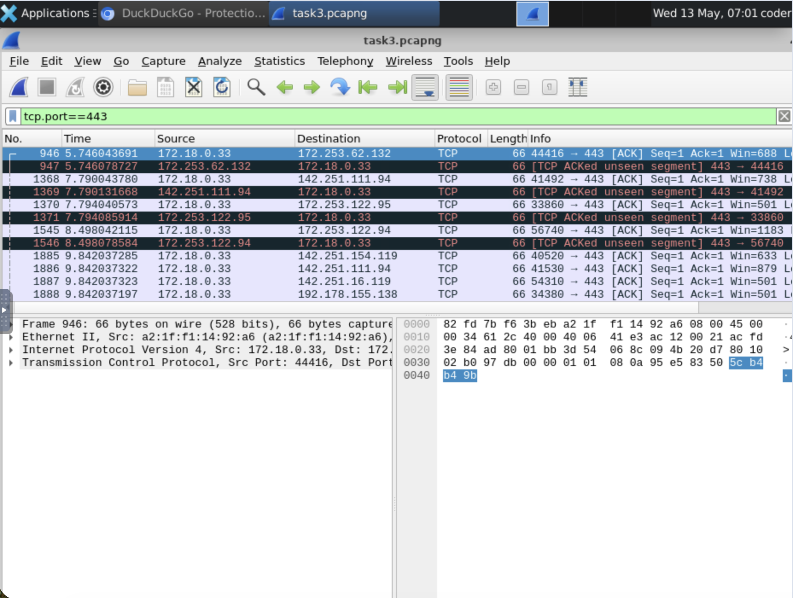

## Task3
### Use a display filter to detect HTTPS packets:
* To detect HTTPS packets we need to start capturing packets in Wireshark and visit
duckduckgo.com in the browser and after that stop and save the captured file.
* To display certain packets in an existing packet capture, use a display filter.
* To display only HTTPS traffic, use a filter on TCP port 443: tcp.port == 443

After using this display feature

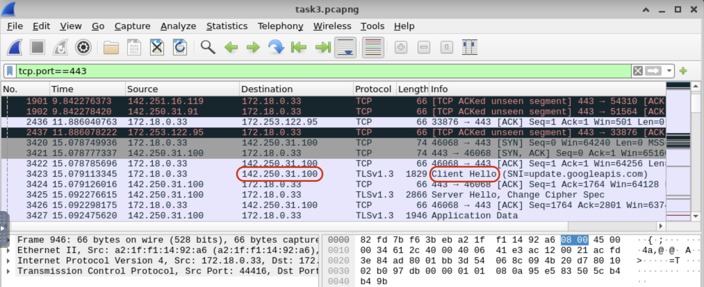

* Look for “client Hello” in info this is the packet for duckduckgo.com
* The destination address here is the ip address of this website.

We can get additional information of the packet by clicking on it.

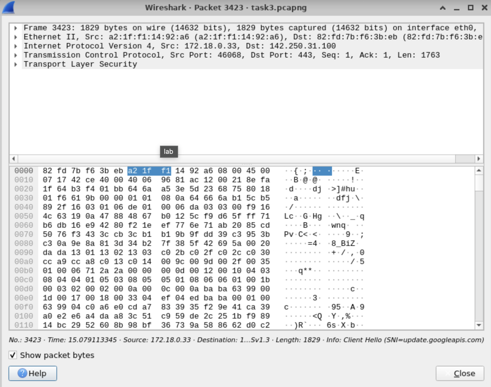

## Task 4
### Visit a web page and detect its IP address using a display filter:

* Start the capture in Wireshark, visit http://cygwin.com (make sure its http and not https), stop the capture
* Save the file for future reference.
* Use the display filter : tcp.port==80

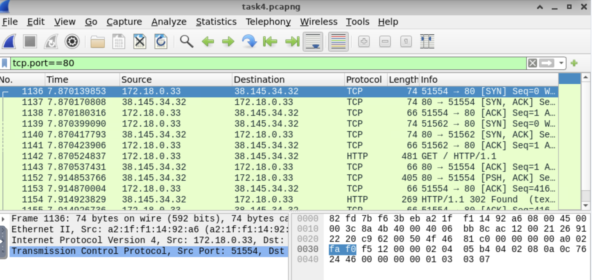

* You can get the destination ip and other information for the port 80 here which is used for http.
* Double click on a packet to get more information

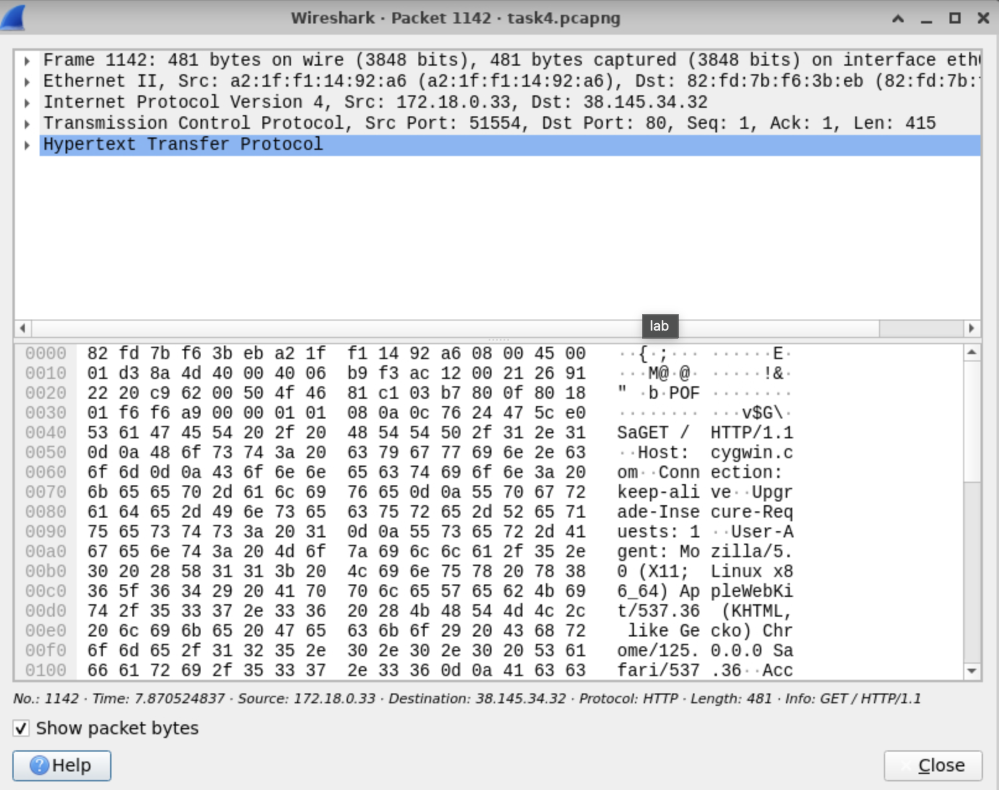
  
## Task 5
### Visit a web page and detect its IP address using a display filter:
* A TLS handshake display filter may be used to detect a website visit in a packet list:
tls.handshake.type ==1
* The IP address is used in a filter to obtain packet information for a particular website: ip.addr ==
<ip_address>
* You can also filter out using either other destination addresses by replacing ip.addr to ip.src or ip.dst

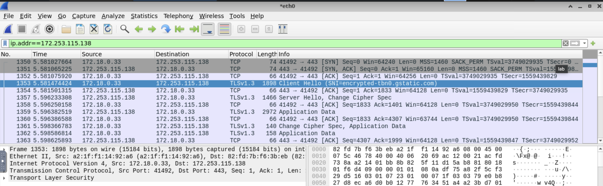

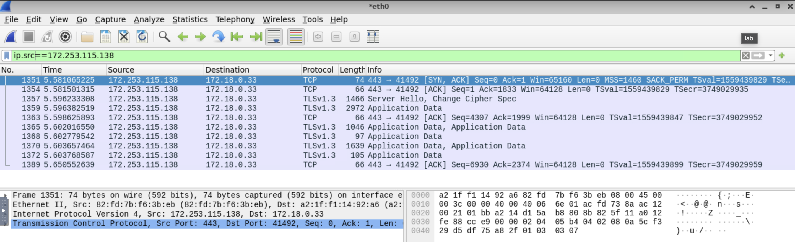

## Task 6
### Locate all HTTPS packets from a capture not containing a certain IP address:
* A Conditional statement may be used to include and eliminate packets from a Wireshark capture: !(ip.addr == 192.178.155.113) and tcp.port == 443

* A compound conditional should include parentheses to avoid order of execution errors: !(ip.addr == 192.178.155.113) and (tcp.port == 80 or tcp.port == 443)

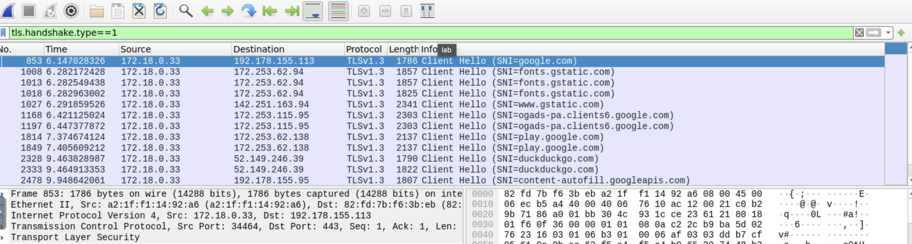
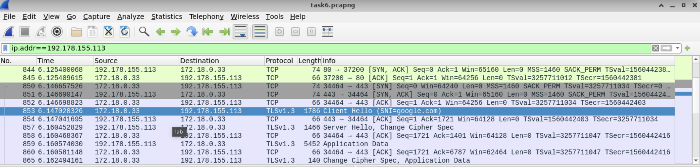
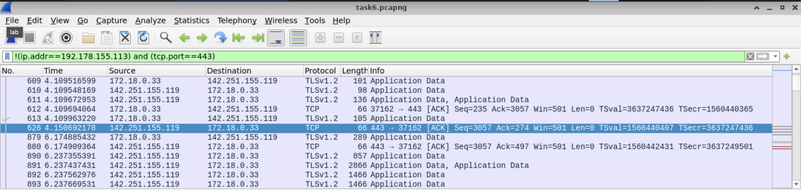
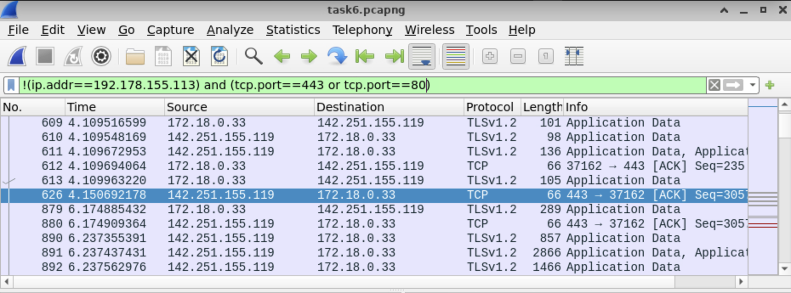
